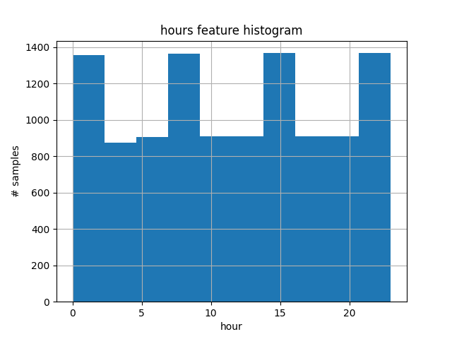
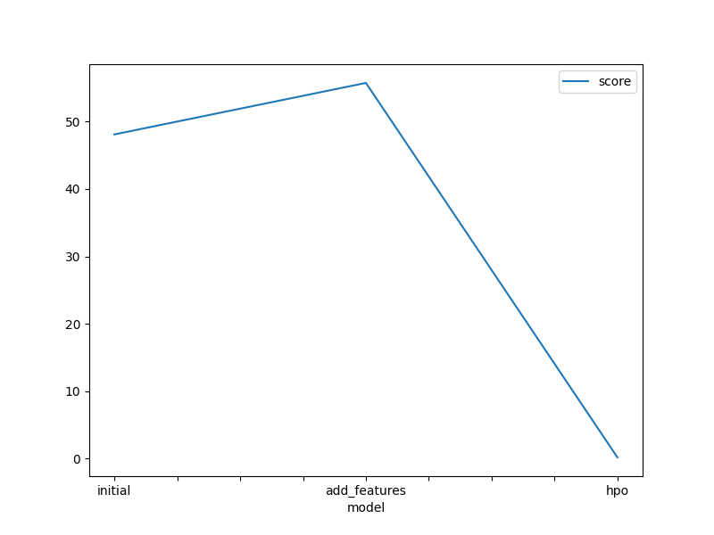
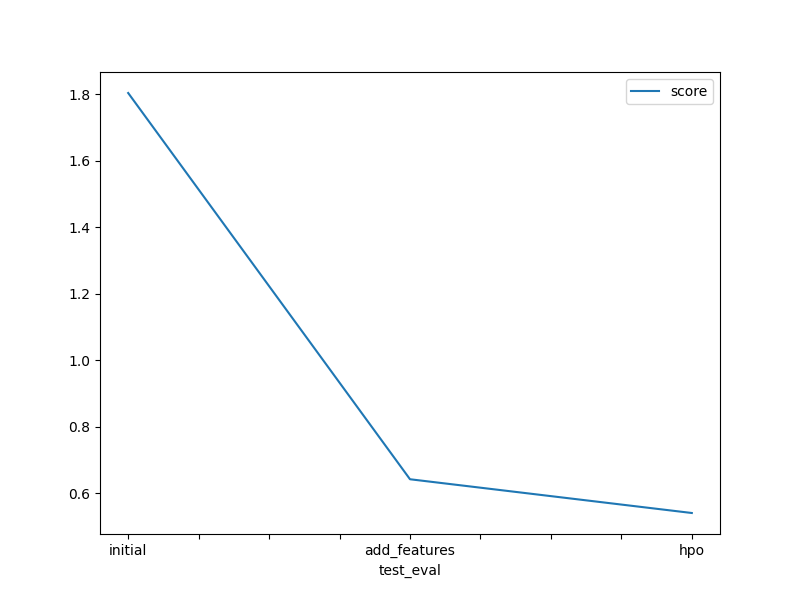

# Report: Predict Bike Sharing Demand with AutoGluon Solution
#### Suraj M Parui

#### Sorry Sir/Madam i had issues with exporting to HTML it was showing an error so i uploaded a Markdown file

## Initial Training
### What did you realize when you tried to submit your predictions? What changes were needed to the output of the predictor to submit your results?
During the initial stage of training, I carefully checked the predictions to identify any negative values. Fortunately, all the values turned out to be positive, which meant I didn't have to assign any values to 0 before submitting. Although I considered converting the count column from float32 to int64, I realized that it wasn't necessary for the regression output based on the competition's evaluation metric, which is the root mean square logarithmic error.

### What was the top ranked model that performed?
The highest-performing model, which obtained the lowest root mean square error (RMSE) score, was the Weighted_Ensemble_L3 model. This model was created by stacking three layers of previously trained models, aiming to maximize the validation accuracy.

## Exploratory data analysis and feature creation
### What did the exploratory analysis find and how did you add additional features?
During the exploratory data analysis (EDA) phase, I examined the histograms and made several observations:

Certain features, such as "holiday" and "working day," were binary in nature.
Other features, including "temp," "atemp," "humidity," and "windspeed," exhibited a near-normal distribution.
Some features, like "season" and "weather," were categorical. It appeared that while the data was distributed fairly evenly across the four seasons, there was a predominant weather category (1).
The data followed a monthly pattern across the years 2011 and 2012. The first 19 days of each month were allocated for training, while the remaining days were designated for testing. Furthermore, the data was recorded at various hours throughout the day.
In line with the recommendations in the notebook, I decided to include the "hour" feature in the dataset. This choice seemed logical as it provided a more general characteristic that could help the trained models better understand the potential demand for bike sharing during different times of the day, without specifying a particular year, month, or day.

### How much better did your model perform after adding additional features and why do you think that is?
The top-performing model demonstrated a significant improvement in performance, with the root mean square error (RMSE) decreasing from 55.72 to 0.1861 for the validation score. Additionally, the test error, measured by the root mean square logarithmic error (RMSLE), decreased from 1.80405 to 0.6416. These improvements can be attributed to the inclusion of the "hour" feature in the dataset.

The addition of the "hour" feature provided valuable information and insights to the trained models. It allowed them to better understand the general patterns of bike share demand throughout the day, without being restricted to specific years, months, or days. Based on the histogram analysis of the "hour" feature, it was evident that the data was recorded relatively evenly across all hours of the day. This indicates that the "hour" feature contained valuable information, contributing to the improved performance of the models.

## Hyper parameter tuning
### How much better did your model perform after trying different hyper parameters?

The best model showed an increase in training root mean square error (RMSE) from 48.086 to 55.72. However, the model's test error decreased significantly from 1.80405 to 0.6416. This suggests that the new model may have a slightly higher bias but better variance, resulting in improved generalization on the test data.

The reason for this improvement could be attributed to my focus on tree-based models with boosting ensemble techniques, specifically Gradient Boosting, CATboost, and XGBoost, during the hyperparameter optimization (HPO) phase. These models performed exceptionally well with their default settings. In contrast, before HPO, Autogluon attempted a wider range of model types, potentially leading to slight overfitting of the data.

By narrowing the focus to the tree-based models and utilizing boosting ensemble techniques, the new model achieved better generalization and reduced the test error, indicating improved performance and stronger ability to capture underlying patterns in the data.

### If you were given more time with this dataset, where do you think you would spend more time?
After assessing the results, I believe it would be beneficial to allocate more time to feature engineering and exploring new features. While hyperparameter tuning is crucial for achieving the best model performance, the significant improvement observed by solely adding the "hour" feature, without modifying the default settings of the models employed by Autogluon, suggests that feature engineering plays a crucial role in enhancing performance.

Therefore, I would prioritize dedicating additional time to feature engineering before delving into hyperparameter optimization. This approach would involve identifying and creating new features that could potentially provide valuable insights and boost the model's performance. By focusing on feature engineering initially, we can lay a solid foundation for the models to extract meaningful patterns and relationships from the data, potentially leading to further improvements in overall performance.

### Create a table with the models you ran, the hyperparameters modified, and the kaggle score.

model	hpo1	hpo2	hpo3	score
0	initial	default_vals	default_vals	default_vals	1.80405
1	add_features	default_vals	default_vals	default_vals	0.64160
2	hpo	GBM (Light gradient boosting) : num_boost_roun...	XGB (XGBoost): n_estimators : [lower=100, uppe...	CAT (CATBoost) : iterations : 100, depth : [lo...	0.54003

### Create a line plot showing the top model score for the three (or more) training runs during the project.

### Create a line plot showing the top kaggle score for the three (or more) prediction submissions during the project.

## Summary
To summarize, this project highlighted the critical importance of both feature engineering and hyperparameter optimization in the machine learning workflow. It can be seen as an iterative process, where we alternate between extracting new features from the available data, performing exploratory data analysis (EDA), and experimenting with different models incorporating these new features. This iterative approach allows us to continuously refine the model's performance until we achieve satisfactory values for validation and test errors.

By iteratively extracting new features, conducting EDA, and evaluating different models, we can uncover valuable insights and patterns in the data. This process enables us to enhance the model's ability to capture the underlying relationships and make accurate predictions. It is through this iterative and cyclical approach that we can iteratively improve and refine our machine learning solution, ultimately aiming for optimal performance.
